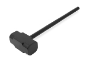

# Dhammer

Dhammer is a stress-tester for DHCP servers.  It currently only supports DHCPv4, but it was created with the strong intention of including DHCPv6 in the very near future.

**Please, read the full disclaimer at the bottom of this document**.

**This tool is meant for testing YOUR OWN networks and servers**.  I wrote this with the intention of using it to stress-test a DHCP framework I have in development and to aid in the addition of DHCPv6 features to the framework.  Thus, Dhammer is meant to be used as a diagnostic tool, and it should not be used for malicious activity.

Dhammer can act as a "local" DHCP client broadcasting packets, or it can simulate a DHCP relay, allowing you to test DHCP servers outside of your local network and also to avoid any potential broadcast-storm safeguards your router might have.

## Getting Started

Just download, compile, and run.

### Dependencies

https://github.com/google/gopacket

https://github.com/google/gopacket/layers

### Installing

```
go get -u github.com/ipchama/dhammer
go build dhammer.go
```
## Examples
#### Broadcast on the local network 
```
sudo ./dhammer --interface wlan1 --mac-count 10000 --rps 100 --maxlife 0
```
#### Target a specific server via DHCP relay
```
sudo ./dhammer --interface wlan1 --mac-count 10000 --gateway-mac "48:f8:b6:f7:30:28" --rps 1000 --maxlife 0 --relay-target-server-ip 192.168.1.1 --relay-source-ip 192.168.1.143
```
To use the relay, particularly if you'll be attempting to test a server across the WAN, you'll need to pass in the MAC of your gateway, which can easily be obtained by checking your ARP table (Ex: `arp -a -n`).  I hope to have gateway MAC detection become automatic in a future release.

Dhammer uses very raw sockets to do its job, so `CAP_NET_ADMIN` and `CAP_NET_RAW` are needed at the very least.  I.e., just `sudo` and get moving.

```
./dhammer --help
Usage of ./dhammer:
  -dhcp-broadcast
    	Set the broadcast bit. (default true)
  -dhcp-option value
    	Additional DHCP option to send out in the discover. Can be used multiple times. Format: <option num>:<RFC4648-base64-encoded-value>
  -dhcpinfo
    	Blast DHCPINFO packets, but don't complete the handshake. NOT YET IMPLEMENTED.
  -ethernet-broadcast
    	Use ethernet broadcasting. (default true)
  -gateway-mac string
    	MAC of the gateway. (default "de:ad:be:ef:f0:0d")
  -handshake
    	Attempt full handshakes (default true)
  -interface string
    	Interface name for listening and sending. (default "eth0")
  -mac-count int
    	Number of unique MAC addresses to pre-generate. (default 1)
  -maxlife int
    	How long to run. 0 == forever
  -relay-source-ip string
    	Source IP for relayed requests.  relay-source-ip AND relay-target-server-ip must be set for relay mode.
  -relay-target-server-ip string
    	Target/Destination IP for relayed requests.  relay-source-ip AND relay-target-server-ip must be set for relay mode.
  -release
    	Release leases - NOT YET IMPLEMENTED
  -rps int
    	Max number of packets per second. 0 == unlimited.
  -stats-rate int
    	How frequently to display stats (seconds). (default 5)
```
## Contributing

Contributions are welcome.  In particular, help me make the stats better! :D

## Authors

* **IPCHama** - *Initial work* - [ipchama](https://github.com/ipchama)

## License

This project is licensed under the GPL v3 License - see the [LICENSE.md](LICENSE.md) file for details

## Disclaimer

BY USING AND/OR UTILIZING THE CODE FROM THIS REPOSITORY IN ANY FORM, COMPILED BINARY FORM OR OTHERWISE, YOU HEREBY ASSUME ALL OF THE RISK IN ANY AND ALL ACTIVITIES ASSOCIATED WITH ANY USE, including by way of example and not limitation, any risks that may arise from negligence or carelessness on the part of any persons or entities making use of the content of this repository for any purpose. 

By making use of the content of this repository you agree to the following:

( A ) YOU WILL NOT use the content of this repository in any form, compiled or otherwise, for malicious activity.

( B ) INDEMNIFY AND HOLD HARMLESS the creators and maintainers of all code in this repository from any and all liabilities or claims made as a result of using the content of this repository in any activity. 

I acknowledge that the creators and maintainers of this repository are NOT responsible for the errors, omissions, acts, or failures to act of any party or entity conducting any activity that makes use of the content of this repository. 

This Release of Liability waiver shall be construed broadly to provide a release and waiver to the maximum extent permissible under applicable law. 
BY MAKING USE OF ANY CONTENT OF THIS REPOSITORY AND/OR PROJECT, YOU CERTIFY THAT YOU HAVE READ THIS DOCUMENT AND YOU FULLY UNDERSTAND ITS CONTENT.


